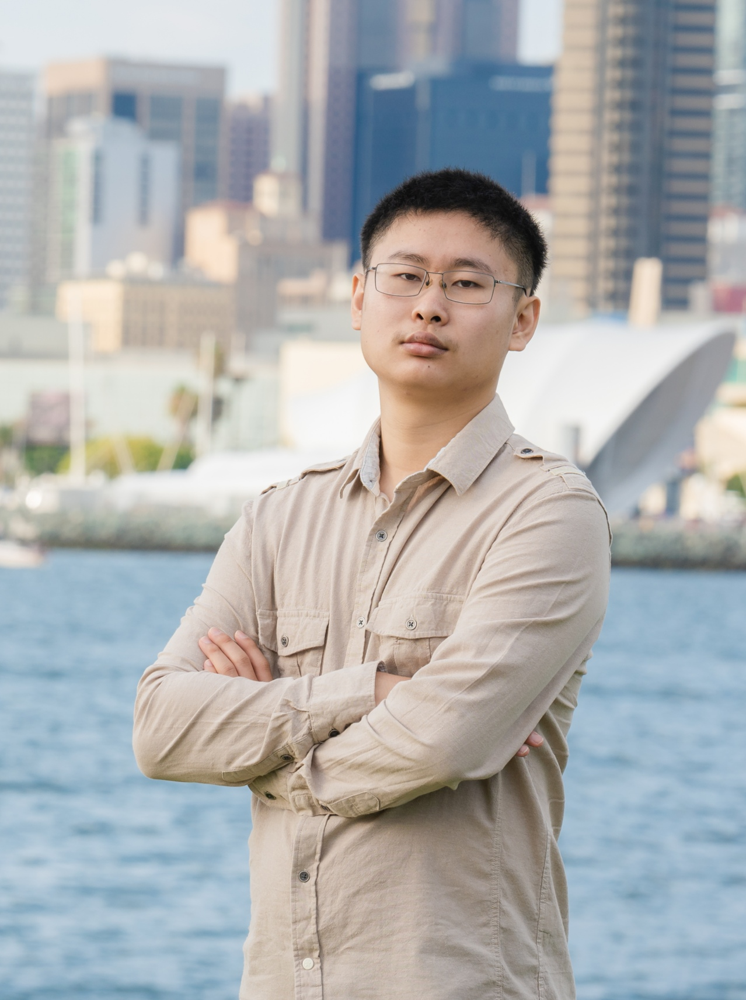
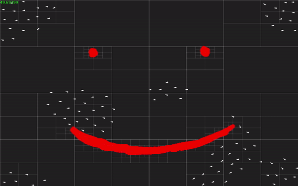

# Aaron Li

[Resume](resume.pdf)
[LinkenIn](https://www.linkedin.com/in/aaron-li-029843222/)

Lorem ipsum dolor sit amet, consectetur adipiscing elit. Quisque ultrices dolor id sapien interdum vehicula. Vestibulum ante ipsum primis in faucibus orci luctus et ultrices posuere cubilia curae; Integer ac tellus et elit ultricies malesuada ac tincidunt sem. Curabitur sed diam eu ante cursus convallis vel eu nulla. Maecenas in turpis eu risus gravida mattis nec sed tortor. Sed hendrerit facilisis nulla, a porta dui. Vivamus felis tortor, imperdiet at venenatis quis, consequat eu eros. Cras ut ipsum eget purus facilisis rhoncus vel non metus. Aliquam in accumsan nibh. Nam porttitor mauris porta, congue purus et, facilisis urna. Vestibulum hendrerit eros et lacus venenatis maximus. Aliquam vitae ante id ante euismod semper. Interdum et malesuada fames ac ante ipsum primis in faucibus. Aenean volutpat et sapien et pretium. 

## Projects

### Sorting

<!--  -->

Compares several sorting algorithms.

* Sorting thing
* Fractals
* Boids
* Something Else

### Boid Simulation

- Simulates a flock of boids with attempted obstacle avoidance

### Fractal Generation

- Generates images of the Mandelbrot set and its Julia set.

### Pyramid Based Image Fusion

- Deconstructs two images into Laplacian pyramids, merges each layer, then reconstructs a merged image.
- Interactive UI made using QT
- Image input/output made using OpenCV